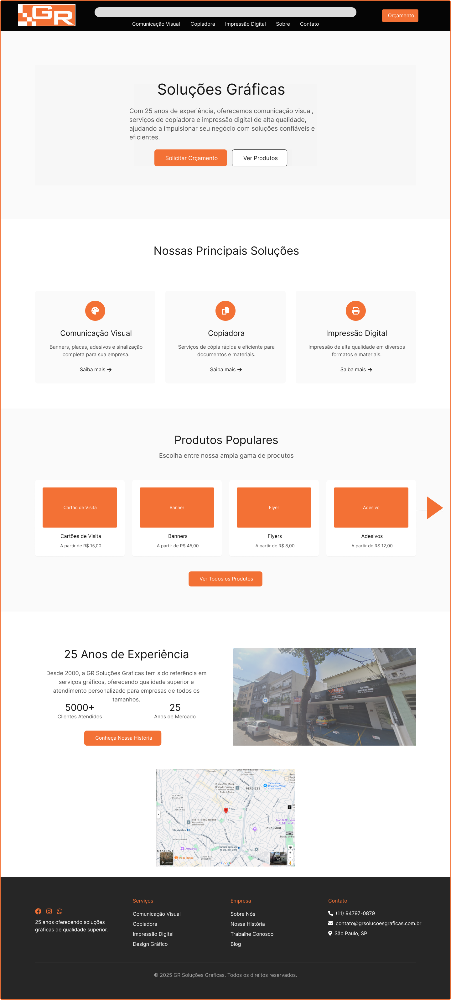

Esse GitHub é o repositório do Projeto Lagarta de Web Mobile.

Nosso objetivo é desenvolver um site para a Gráfica GR Soluções Gráficas, empresa que atua há 25 anos no mercado, localizada em Sumaré.

O site será um shop B2B e B2C, oferecendo os seguintes serviços:

* Produtos e serviços de gráfica (impressão em geral).

* Produtos populares da gráfica, com preços e descrições.

* Soluções gráficas para empresas (B2B), com serviços recorrentes.

Atualmente, estamos na primeira etapa: idealização e prototipagem do projeto. Já desenvolvemos os wireframes que mostram como o site será estruturado:

Wireframe Desktop:

Wireframe Mobile:

Os wireframes foram criados no Figma.

Na construção da página, desenvolvemos uma experiência fluida para o cliente, com foco na simplicidade. Além disso, garantimos a responsividade do site em dispositivos móveis e contamos a história da gráfica por meio da página "Sobre".

